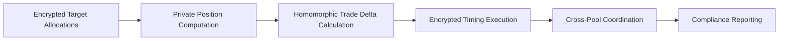
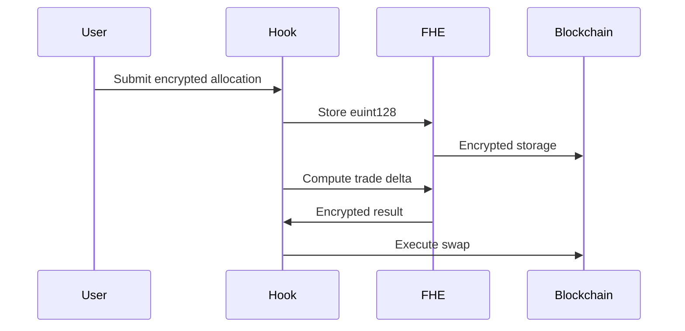
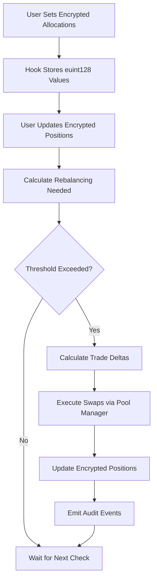

# Architecture

Understanding the architecture of Umbra Finance will help you leverage its full potential for confidential multi-asset rebalancing.

## Overview

Umbra Finance is built on three core pillars:

1. **Uniswap v4 Hooks** - Deep integration with Uniswap v4's hook system
2. **Fully Homomorphic Encryption (FHE)** - Fhenix FHE for confidential computations
3. **Institutional-Grade Security** - MEV protection, reentrancy guards, access control

## Core Flow



## System Components

### 1. Strategy Management

Each rebalancing strategy is identified by a unique `bytes32 strategyId` and contains:

```solidity
struct RebalancingStrategy {
    address owner;                    // Strategy owner
    uint256 rebalanceFrequency;       // Frequency in blocks
    uint256 lastRebalance;            // Last execution block
    euint128 executionWindow;         // Encrypted execution window
    euint128 spreadBlocks;            // Encrypted spread blocks
    euint128 maxSlippage;             // Encrypted max slippage
    bool isActive;                    // Strategy status
    bool isGovernanceStrategy;        // DAO governance flag
}
```

### 2. Encrypted Target Allocations

Target allocations are stored in encrypted form using FHE:

```solidity
struct EncryptedTargetAllocation {
    Currency currency;                // Asset currency
    euint128 targetPercentage;        // Encrypted basis points (0-10000)
    euint128 minThreshold;            // Encrypted minimum deviation threshold
    euint128 maxThreshold;            // Encrypted maximum deviation threshold
    bool isActive;                    // Allocation status
}
```

**Key Features:**
- All percentages encrypted using `euint128`
- Thresholds prevent unnecessary rebalancing
- Multi-asset support via Currency type

### 3. Homomorphic Calculations

The core innovation is performing calculations on encrypted data:

```solidity
// Calculate target position (encrypted)
euint128 targetPosition = FHE.mul(totalValue, targetPercentage);

// Calculate trade delta (encrypted)
euint128 tradeDelta = FHE.sub(targetPosition, currentPosition);

// Check if rebalancing needed (encrypted boolean)
ebool needsRebalancing = FHE.gt(absDeviation, minThreshold);
```

**Benefits:**
- ✅ No intermediate values revealed
- ✅ Strategy remains completely confidential
- ✅ Prevents front-running and copycat trading

### 4. Execution Engine

The execution engine handles the actual rebalancing:

```solidity
function executeRebalancing(bytes32 strategyId) external returns (bool) {
    // 1. Verify permissions
    require(msg.sender == strategy.owner, "Unauthorized");
    
    // 2. Check timing (encrypted)
    require(canExecute(strategyId), "Execution window not open");
    
    // 3. Execute trades across pools
    for (uint i = 0; i < tradeDeltas.length; i++) {
        executeSwap(strategyId, tradeDeltas[i]);
    }
    
    // 4. Update state
    strategy.lastRebalance = block.number;
    
    return true;
}
```

## FHE Integration

### Encryption Flow



### Supported Operations

| Operation | Function | Description |
|-----------|----------|-------------|
| Addition | `FHE.add(a, b)` | Add encrypted values |
| Subtraction | `FHE.sub(a, b)` | Subtract encrypted values |
| Multiplication | `FHE.mul(a, b)` | Multiply encrypted values |
| Division | `FHE.div(a, b)` | Divide encrypted values |
| Comparison | `FHE.gt(a, b)` | Greater than comparison |
| Comparison | `FHE.lt(a, b)` | Less than comparison |

### Selective Reveal

For compliance and auditing, encrypted values can be selectively revealed:

```solidity
function revealPosition(
    bytes32 strategyId,
    Currency currency,
    Permission calldata permission
) external view returns (uint256) {
    require(hasPermission(msg.sender, permission), "Unauthorized");
    return FHE.decrypt(_encryptedPositions[strategyId][currency]);
}
```

## Security Architecture

### 1. Reentrancy Protection

Strategy-level locks prevent reentrancy attacks:

```solidity
modifier nonReentrant(bytes32 strategyId) {
    require(!_executionLocks[strategyId], "Strategy execution in progress");
    _executionLocks[strategyId] = true;
    _;
    _executionLocks[strategyId] = false;
}
```

### 2. MEV Protection

Block-level execution control prevents MEV exploitation:

```solidity
modifier mevProtection() {
    require(
        block.number == _lastExecutionBlock[msg.sender],
        "MEV protection: execution must be in same block"
    );
    _;
}
```

### 3. Access Control

Multi-level permission system:

```solidity
enum PermissionLevel {
    NONE,           // No access
    VIEWER,         // Can view encrypted data
    EXECUTOR,       // Can execute rebalancing
    MANAGER,        // Can modify strategy
    OWNER           // Full control
}
```

## Uniswap v4 Hook Integration

### Hook Points

Umbra Finance implements the following hook points:

```solidity
function beforeSwap(
    address sender,
    PoolKey calldata key,
    IPoolManager.SwapParams calldata params,
    bytes calldata hookData
) external override returns (bytes4) {
    // Pre-swap logic
    return IHooks.beforeSwap.selector;
}

function afterSwap(
    address sender,
    PoolKey calldata key,
    IPoolManager.SwapParams calldata params,
    BalanceDelta delta,
    bytes calldata hookData
) external override returns (bytes4) {
    // Post-swap logic: update positions, check thresholds
    return IHooks.afterSwap.selector;
}
```

### Hook Permissions

The hook requires the following permissions:

- `BEFORE_SWAP_FLAG` - Pre-swap execution
- `AFTER_SWAP_FLAG` - Post-swap position updates
- `BEFORE_ADD_LIQUIDITY_FLAG` - Liquidity event tracking
- `AFTER_ADD_LIQUIDITY_FLAG` - Position recalculation

## Data Flow

### Complete Rebalancing Cycle



## Gas Optimization

### Performance Metrics

| Operation | Gas Cost | Optimization |
|-----------|----------|--------------|
| Strategy Creation | ~655K | Minimal storage |
| Set Allocation | ~1.1M | Batch updates |
| Calculate Rebalancing | ~2.1M | Efficient FHE ops |
| Execute Rebalancing | ~3.6M | Optimized swaps |
| Cross-Pool Coordination | ~1.2M | Parallel execution |

### Optimization Techniques

1. **Batch Operations**: Group multiple allocations in single transaction
2. **Lazy Evaluation**: Only compute when thresholds exceeded
3. **Efficient Storage**: Pack data structures to minimize SSTORE operations
4. **FHE Caching**: Reuse encrypted computations when possible

## Scalability

### Multi-Pool Support

The hook supports rebalancing across multiple Uniswap v4 pools:

```solidity
struct CrossPoolExecution {
    PoolKey[] pools;
    euint128[] amounts;
    euint128[] minOutputs;
}
```

### Concurrent Strategies

Multiple strategies can run simultaneously:

- Independent execution locks per strategy
- Parallel computation of trade deltas
- Non-blocking position updates

import { Callout } from 'nextra/components'

<Callout type="info">
  **Performance Tip**: For large portfolios, consider batching allocation updates and using multi-block execution spreading to optimize gas costs.
</Callout>

## Next Steps

- **[API Reference](/docs/api-reference)** - Detailed function documentation
- **[Examples](/docs/examples)** - Real-world usage patterns
- **[Security](/docs/security)** - In-depth security analysis
